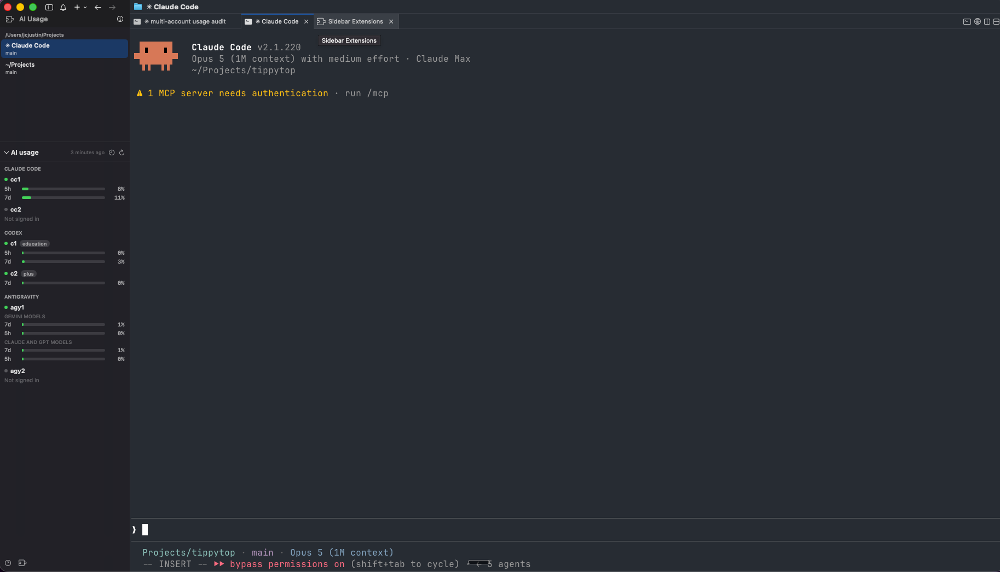
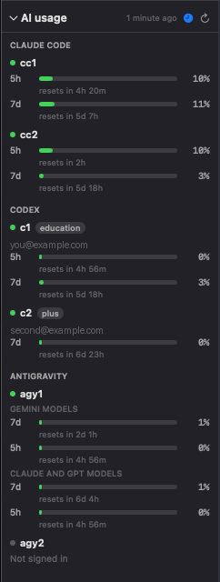

# cmux AI Usage Sidebar

A [cmux](https://github.com/manaflow-ai/cmux) sidebar that shows how much of its
rate limit each local AI agent account has spent. It reads Claude Code, Codex,
and Antigravity accounts, including second accounts of the same agent.



cmux shows one sidebar at a time, so an extension sidebar replaces the built-in
one. This sidebar therefore also lists the cmux workspaces and switches between
them. Workspaces stay on top, because they are the primary navigation. Usage is
reference data, so it sits below and collapses from its header.

Drag the divider to change how the two halves share the height. Double-click the
divider to fit the workspace list to its rows again.

The clock button discloses more about each account: the signed-in address, and
when each window resets.



A grey dot and "Not signed in" mark an account that has no valid credential.
A bar turns orange above 50 percent and red above 80 percent.

## Architecture

The project has two components, because a cmux sidebar extension is sandboxed.

```
  aiusaged (LaunchAgent, unsandboxed)          AI Usage Sidebar.appex (sandboxed)
  ├── reads the login keychain                 ├── entitlement: network.client only
  ├── reads ~/.codex*/auth.json                │
  ├── refreshes the Antigravity token          │
  ├── calls the three usage APIs               │
  └── serves JSON on 127.0.0.1:47823  ────────▶└── polls that URL every 60s
```

The extension cannot read the keychain or the credential files. App Groups need
a provisioning profile that a personal team does not get. An outgoing loopback
socket is the one channel that works with `network.client` alone. The extension
therefore never holds a token.

No credential and no usage figure leaves your machine, except in the request
that each agent vendor already receives from its own CLI.

## Requirements

- macOS 14 or newer.
- cmux 0.64.20 or newer. Earlier builds have no sidebar extension point. Run
  `cmux --version` to check.
- Xcode 16 or newer.
- An Apple Development signing identity. A free personal team is sufficient.

## Install with an AI agent

Two parts of the install depend on your machine: your Apple signing team, and
which agent accounts you have. This repository ships a skill that finds both,
and then does the rest.

Copy the skill to your agent's skill directory, then ask for the setup:

```bash
cp -R skills/cmux-ai-usage-setup ~/.claude/skills/
```

Then say: *"set up the cmux AI usage sidebar"*.

The agent reads your certificate for the team ID, finds your accounts, asks what
you call each one, and writes the config. It cannot click the cmux settings
window, so it gives you those four steps at the end.

The skill is plain Markdown at `skills/cmux-ai-usage-setup/SKILL.md`. Any agent
that reads a file can follow it. To install by hand instead, use the steps below.

## Install by hand

Do these steps one time.

### 1. Set your signing team

The project file holds the original author's team ID. You cannot sign with it.
Find your own team ID in Xcode. Open Settings, then select Accounts.
Export the ID before you build:

```bash
export DEVELOPMENT_TEAM=ABCDE12345
```

`install-app.sh` reads this variable. Your checkout stays unmodified.

### 2. Get the cmux SDK

```bash
./scripts/fetch-sdk.sh
```

The script clones cmux and keeps the extension SDK in `vendor/`. cmux has no
package manifest at its root, so SwiftPM cannot fetch the SDK as a remote
dependency.

### 3. Install the daemon

```bash
./scripts/install-daemon.sh
```

The script builds `aiusaged` and installs the binary in `~/.local/bin`. It then
starts a LaunchAgent and waits for the first snapshot. The daemon writes a
default config file at the first start. Step 6 shows how to change that file.

### 4. Install the extension

```bash
./scripts/install-app.sh
```

The script builds the app and copies it to `/Applications`. It opens the app one
time, because macOS finds an extension only after the containing app runs.

### 5. Select the sidebar in cmux

1. Open Settings and select Advanced. Set the Extensions toggle to on.
   The puzzle button stays hidden until this toggle is on.
2. Click the puzzle button. It is adjacent to the sidebar help button.
3. Select Sidebar Extensions and enable AI Usage.
4. Select the extension sidebar provider in the same menu.

Enable one entry only. If the list shows AI Usage more than one time, Launch
Services holds a stale build copy. Run `./scripts/install-app.sh` again. The
script removes the stale copies.

### 6. Check your accounts

The daemon finds your accounts itself. At the first start it writes what it found
to `~/.config/ai-usage/config.json`. To see the same list without a write, run:

```bash
~/.local/bin/aiusaged --discover
```

Discovery reads the login keychain for `Claude Code-credentials*` items. It looks
for `auth.json` under each `~/.codex*` directory. It looks for an Antigravity
token under your home directory and its dot-directories. It names the first
account of each kind plainly and numbers the rest: `claude`, `claude-2`, `codex`,
`codex-2`.

Edit the file for two reasons. Rename an account to what you call it, because
`claude-2` says nothing. Add an account that is signed out, because a store with
no credential in it is invisible to discovery. Then restart the daemon:

```bash
launchctl kickstart -k "gui/$UID/dev.jcsnap.aiusaged"
```

The file wins once it exists. A later scan never overwrites your names.

The file lists one entry per account:

```json
{
  "port": 47823,
  "refreshSeconds": 300,
  "accounts": [
    { "id": "cc1", "provider": "claude", "displayName": "cc1",
      "keychainService": "Claude Code-credentials" },
    { "id": "c1", "provider": "codex", "displayName": "c1",
      "codexHome": "~/.codex" },
    { "id": "agy1", "provider": "antigravity", "displayName": "agy1",
      "home": "~" }
  ]
}
```

Each provider keeps its credential in a different store. The fields differ for
that reason:

| provider | field | credential |
|---|---|---|
| `claude` | `keychainService` | login keychain item |
| `codex` | `codexHome` | `$CODEX_HOME/auth.json` |
| `antigravity` | `home` | `<home>/.gemini/antigravity-cli/antigravity-oauth-token` |

Claude Code derives a keychain suffix from `CLAUDE_CONFIG_DIR`. To find the
service name of a second Claude account, run:

```bash
security dump-keychain | grep -o '"Claude Code[^"]*"' | sort -u
```

## Verify

List the accounts this machine has:

```bash
~/.local/bin/aiusaged --discover
```

Print one snapshot without the daemon:

```bash
swift run aiusaged --once
```

Read what the running daemon serves:

```bash
curl -s http://127.0.0.1:47823/ | python3 -m json.tool
```

The daemon writes its log to `~/Library/Logs/ai-usage/aiusaged.log`.

## Endpoints

Each provider exposes usage over its own OAuth token. None of these endpoints is
documented. Each one can change without notice.

| provider | request |
|---|---|
| Claude | `GET api.anthropic.com/api/oauth/usage`, header `anthropic-beta: oauth-2025-04-20` |
| Codex | `GET chatgpt.com/backend-api/wham/usage`, header `chatgpt-account-id` |
| Antigravity | `POST cloudcode-pa.googleapis.com/v1internal:retrieveUserQuotaSummary` |

Two behaviours are easy to misdiagnose:

- The Antigravity endpoint answers `403 PERMISSION_DENIED` unless the
  `User-Agent` names the antigravity client. That is client sniffing, not a
  missing OAuth scope.
- A logged-out Claude profile still has a keychain item. That item holds only
  `mcpOAuth`. Its presence is not proof of a login.

Antigravity needs one more thing: only the OAuth client that issued a refresh
token can refresh it. That client belongs to the Antigravity CLI, so this project
reads it out of the installed `agy` binary rather than keeping a copy. The binary
holds more than one client, so each candidate is tried once and the pair that
works is cached at `~/.config/ai-usage/antigravity-client.json`. Set
`ANTIGRAVITY_CLIENT_ID` and `ANTIGRAVITY_CLIENT_SECRET` to override the search.

Antigravity also names its windows in words. `weekly` becomes `7d` at the fetch
layer, so one column width fits every provider.

## Permissions

The extension asks cmux for the least it needs to draw the workspace list:

| scope | use |
|---|---|
| `workspaceList` | workspace identity and order |
| `workspaceMetadata` | title, branch, unread count, current selection |
| `workspacePaths` | project root headings and row subtitles |
| `selectWorkspace` | switch workspace when you click a row |

The extension never asks for surfaces, notifications, ports, or pull requests.
Usage data does not come through cmux at all. It comes from the daemon.

## Develop

```bash
swift build && swift test          # daemon
./.build/debug/aiusaged --once     # print one snapshot and exit
./scripts/sync-models.sh           # after you edit Sources/UsageModels
```

The extension target keeps a generated copy of the wire types, because it is a
separate Xcode target and cannot link the SwiftPM library. `sync-models.sh`
copies them. Do not edit the generated file.

Add a provider in four steps. Add a case to `UsageProvider`. Add a client that
conforms to `UsageProviderClient`. Add the credential field to `AccountConfig`.
Add a scan for that credential to `Discovery`, so the new provider needs no
hand-written config either.

## Layout

```
Sources/UsageModels     wire types, shared by both sides
Sources/UsageFetch      credential access and provider HTTP
Sources/aiusaged        refresh loop and loopback server
AIUsageSidebar/         Xcode project: containing app + sidebar extension
skills/                 setup skill for an AI agent
vendor/CmuxExtensionKit copy of the cmux extension SDK
```
